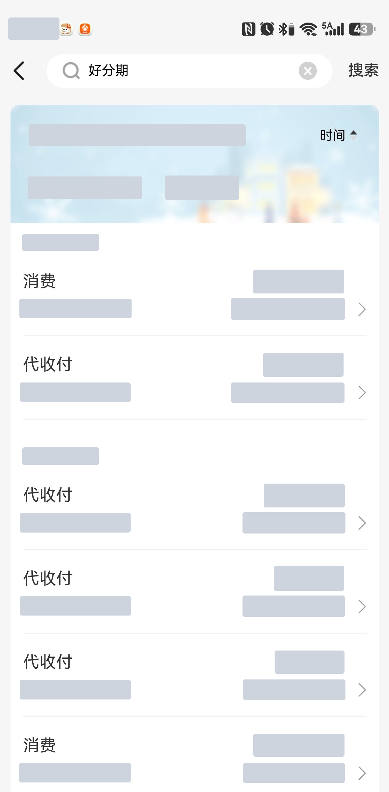
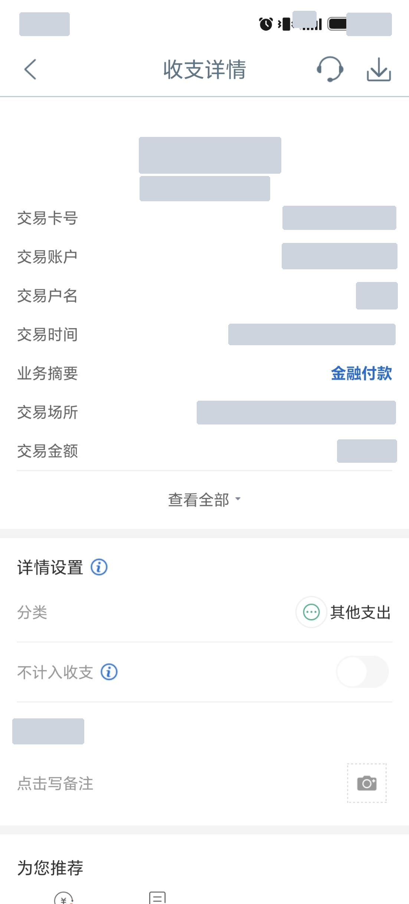

# bill-screenshot-to-excel

把手机银行 / 借款 App 的账单截图，用**本地 OCR** 转成结构化 Excel。
全程离线，截图不上传任何服务器。

包含两个工具：

| 目录 | 工具 | 输入 | 输出 |
|---|---|---|---|
| `billtools/` | 账单截图转 Excel（含账单1 长截图 + 账单2 收支详情） | 截图目录 | `收支详情明细_*.xlsx` / `账单明细_*.xlsx` |
| `bill2excel/` | 账单转表格（长截图专用，前者的早期版本） | 截图目录 | `账单明细_*.xlsx` |

## 输入长什么样

`billtools/` 认两类截图（都已脱敏，原图不入库）：

- **列表长截图** —— 一张超长的交易列表截图（宽 1224，高可达 4 万像素），顶部有吸顶的「支出/收入」汇总卡
- **收支详情单屏图** —— 单笔交易的详情页（1102×2430），字段固定：交易卡号 / 交易账户 / 交易户名 / 交易时间 / 业务摘要 / 交易场所 / 交易金额




> 样例图已做脱敏：所有金额、日期、时间、卡号、余额、户名、商户名都用灰块遮蔽。
> 仓库内**不含任何真实账单数据**，规则见 `.gitignore`（`账单1/`、`账单2/`、`outputs/`、`*.xlsx` 一律不入库）。

## 技术要点

- **OCR**：[`rapidocr-onnxruntime`](https://github.com/RapidAI/RapidOCR)（PP-OCRv4，离线）
- **图片处理**：Pillow + NumPy
- **表格**：openpyxl
- **界面**：tkinter（可打包成单文件 exe）
- **去重**：截图内容 MD5 去重 +「交易时间 + 金额 + 交易后余额 + 卡号」四元组语义去重（同一笔交易被两张截图各记一次时生效）
- **校验**：解析结果与页面汇总卡逐分比对；「交易金额」必须等于顶部金额的绝对值

## 快速开始

前置：Python 3.11+（需要带 tkinter 的版本，GUI 依赖它）。

```bash
pip install rapidocr-onnxruntime openpyxl pillow

python billtools/app.py                        # 图形界面
python billtools/app.py <截图目录>              # 命令行
python billtools/app.py --selftest detail <截图目录>   # 自检
```

打包单文件 exe：

```bash
python billtools/build_exe.py                  # 产物 billtools/dist/账单截图转Excel.exe
python billtools/smoke_test.py                 # 打包后冒烟：自检 + 确认 GUI 真起窗
```

> `build_exe.py` 退出码 0 **不代表产物存在**（本机实测会被终端安全软件拦掉），所以打完包务必跑 `smoke_test.py`。

## 文档

- `docs/superpowers/specs/2026-09-17-bill2excel-design.md`
- `docs/superpowers/specs/2026-09-18-bill-console-design.md`
- `docs/superpowers/specs/2026-09-18-billtools-console-design.md`

## 免责声明

本项目仅用于把**本人**的账单截图整理成表格，方便对账。请遵守相关服务条款与法律法规，不要用它处理你无权处理的他人数据。
